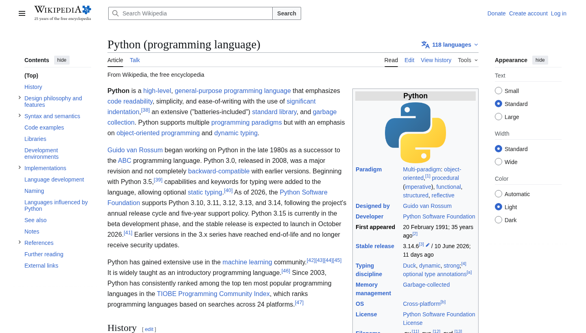
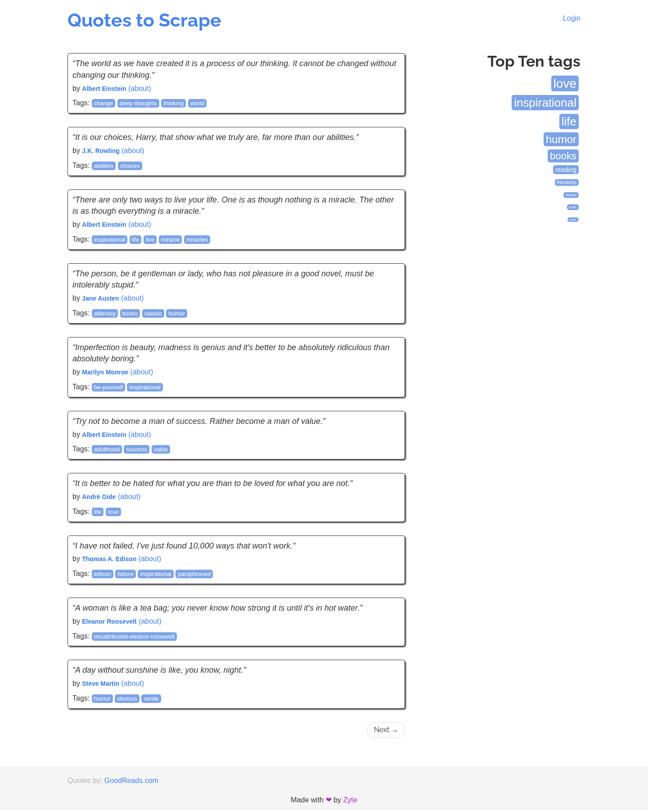
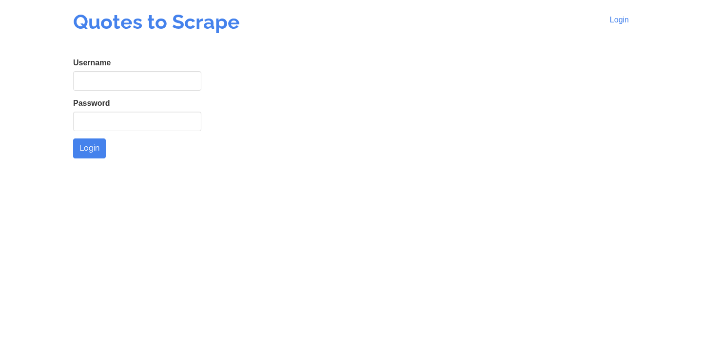

# Polaris MCP

**Browser automation for AI agents — Map First architecture.**

Polaris gives the AI a complete mental map of any website before writing a single automation step.
Named after the North Star: a fixed reference that sailors used to orient themselves before crossing
any sea. Polaris gives the AI that same fixed point — a full structural map of selectors, API calls,
and hidden elements — so it acts with knowledge instead of trial and error.

---

## Architecture

```
KNOWLEDGE   → understand the site first
  browser_map_site               BFS crawl → selector inventory across all pages
  browser_explore_page           Click triggers to reveal hidden dropdowns / modals / tabs
  browser_intercept_network      Capture live XHR/fetch: endpoints, payloads, responses
  browser_accessibility_tree     ARIA tree — works on any site without data-qa attributes
  browser_get_external_resources All external origins a page contacts (DOM + network)

EXECUTION   → act with real selectors
  browser_inject_js           Inject and run JavaScript; returns the result
  browser_run_playwright      Run Python Playwright code directly (no LLM in the loop)
  browser_execute_sequence    Typed JSON action sequence: goto / click / fill / wait_for / ...
  browser_auto_sequence       Map First in one call: map → explore → LLM plans → execute
  browser_run_task            LLM-driven natural language automation (fallback / exploration)

VERIFICATION → confirm what happened
  browser_diff_pages          Structural diff between two page states (before / after)
  browser_capture_console     Browser console output: errors, warnings, logs
  browser_get_storage         Read localStorage, sessionStorage, cookies

AUTHENTICATION
  browser_login               One-off login — saves session to a file path you specify
  browser_session_save        Named login — saves under a friendly name for reuse
  browser_session_check       Verify a named session is still active
  browser_session_list        List all saved sessions

UTILITIES
  browser_screenshot          Capture page as base64 PNG
  browser_get_page_content    Visible page text (no HTML), up to 20,000 characters
  browser_get_help            Return full documentation as a string
```

---

## How it works

```
1. Map the site       →  know every selector before writing a single line
2. Explore pages      →  discover dropdowns / modals hidden behind interactions
3. External resources →  find all external origins (APIs, CDNs, analytics)
4. Intercept APIs     →  see every endpoint the frontend calls, with payloads
5. Inject JS          →  extract tokens, override functions, read JS-only state
6. Execute            →  use real selectors from the map (precise, deterministic)
7. Verify             →  diff the UI state before and after each action

Shortcut (steps 1–6 in one call):
  browser_auto_sequence("your goal", url) → maps, explores, plans via LLM, executes
```

When any AI agent connects to Polaris it receives a full capability briefing automatically
via the FastMCP `instructions` parameter — no manual setup required.

---

## System Requirements

| Requirement | Minimum |
|-------------|---------|
| Python | 3.11 or higher |
| Operating system | Linux or macOS |
| Internet access | Required (Playwright downloads Chromium) |
| LLM API key | At least one of: OpenAI or Anthropic |

---

## Python Dependencies

```
browser-use>=0.2.0
playwright>=1.44.0
mcp[server]>=1.0.0
```

---

## Installation

### 1. Clone the repository

```bash
git clone https://github.com/your-username/polaris-mcp.git
cd polaris-mcp
```

### 2. Create and activate a Python 3.11+ virtual environment

```bash
python3.11 -m venv .venv
source .venv/bin/activate          # Linux / macOS
# .venv\Scripts\activate           # Windows
```

### 3. Install Python packages

```bash
pip install --upgrade pip
pip install browser-use playwright mcp
```

### 4. Install the Chromium browser

```bash
playwright install chromium
```

### 5. Set environment variables

Create a `.env` file in the project root (it is git-ignored):

```bash
# Required: at least one LLM key
OPENAI_API_KEY=sk-...
ANTHROPIC_API_KEY=sk-ant-...

# Optional overrides (these are the defaults)
BROWSER_USE_MODEL=gpt-4o-mini       # LLM for browser_run_task
BROWSER_HEADLESS=true               # false = show the browser window
POLARIS_SESSIONS_DIR=/tmp/polaris_sessions
MCP_HOST=127.0.0.1
MCP_PORT=8016
MCP_TRANSPORT=streamable-http
```

### 6. Start the server

```bash
./start.sh
```

Or directly:

```bash
source .venv/bin/activate
source .env  # or export the variables manually
python browser_python_mcp.py
```

The server listens on `http://127.0.0.1:8016/mcp` by default.

---

## Connecting an AI Client

### Claude Code / Cline / Zed (streamable-http)

Add to your MCP settings:

```json
{
  "polaris": {
    "type": "streamable-http",
    "url": "http://127.0.0.1:8016/mcp"
  }
}
```

### Goose (streamable_http with uri)

```json
{
  "polaris": {
    "type": "streamable_http",
    "uri": "http://127.0.0.1:8016/mcp"
  }
}
```

---

## Environment Variables Reference

| Variable | Default | Description |
|----------|---------|-------------|
| `OPENAI_API_KEY` | — | Required for OpenAI models (e.g. `gpt-4o-mini`) |
| `ANTHROPIC_API_KEY` | — | Required for Anthropic models (e.g. `claude-sonnet-4-6`) |
| `BROWSER_USE_MODEL` | `gpt-4o-mini` | LLM used by `browser_run_task` |
| `BROWSER_HEADLESS` | `true` | Set `false` to show the browser window |
| `POLARIS_SESSIONS_DIR` | `/tmp/polaris_sessions` | Directory for named session files |
| `MCP_HOST` | `127.0.0.1` | Server bind address |
| `MCP_PORT` | `8016` | Server port |
| `MCP_TRANSPORT` | `streamable-http` | MCP transport protocol |

---

## Demos

Real captures from Polaris running against public websites — no mocking, no staging.

---

### 1 — Loading and screenshotting any page

Polaris opens a real Chromium browser (headless or visible), loads the page, and returns a
base64 PNG. Call `browser_screenshot` with any URL:

```python
browser_screenshot("https://en.wikipedia.org/wiki/Python_(programming_language)")
```



> **_polaris telemetry**: `page_load_ms: 322`, `dom_ready_ms: 297`, `console_errors: 0`

---

### 2 — Mapping a site's full structure before writing automation

`browser_map_site` crawls the site via BFS and returns every form, link, selector and
interactive trigger. Here is a real crawl of [quotes.toscrape.com](https://quotes.toscrape.com):



```json
// browser_map_site("https://quotes.toscrape.com/", max_pages=3)
{
  "pages_mapped": 3,
  "pages": [
    {
      "url": "https://quotes.toscrape.com/",
      "title": "Quotes to Scrape",
      "navigation_links": ["/login", "/author/Albert-Einstein", "/tag/change/page/1/", "...46 more"],
      "forms": [],
      "interactive_triggers": []
    },
    {
      "url": "https://quotes.toscrape.com/login",
      "forms": [{
        "inputs": [
          {"name": "csrf_token", "type": "hidden"},
          {"id": "username",     "type": "text"},
          {"id": "password",     "type": "password"},
          {"type": "submit"}
        ]
      }]
    }
  ],
  "_polaris": {"duration_ms": 12984, "browser": {"console_errors": 0}}
}
```

In 13 seconds Polaris discovered the login form, all navigation links, and the full site
structure — without you writing a single selector.

---

### 3 — Auditing what a site sends to third parties

`browser_get_external_resources` combines a static DOM scan with live network interception
to reveal every external origin a page contacts. Here is BBC.com:

```json
// browser_get_external_resources("https://www.bbc.com/")
{
  "external_origin_count": 30,
  "total_external_urls": 202,
  "external_origins": [
    {"hostname": "static.files.bbci.co.uk",       "category": "cdn",       "count": 90},
    {"hostname": "ichef.bbci.co.uk",              "category": "cdn",       "count": 65},
    {"hostname": "securepubads.g.doubleclick.net", "category": "ads",       "count": 4},
    {"hostname": "cdn.cxense.com",                "category": "analytics", "count": 3},
    {"hostname": "cdn.privacy-mgmt.com",          "category": "cdn",       "count": 3},
    {"hostname": "uk-script.dotmetrics.net",      "category": "analytics", "count": 3},
    {"hostname": "cdn.optimizely.com",            "category": "analytics", "count": 1},
    {"hostname": "prebid.the-ozone-project.com",  "category": "ads",       "count": 5}
  ]
}
```

30 external origins, 202 external resources — DoubleClick ads, Optimizely A/B testing,
Cxense analytics, Permutive audience segmentation, all visible in one call.

---

### 4 — Extracting structured data via JavaScript injection

`browser_inject_js` runs arbitrary JavaScript inside the live page and returns the result.
No HTML scraping needed — read directly from the DOM or JS state:

```python
browser_inject_js("""
    (() => {
        const infobox = {};
        document.querySelectorAll('.infobox tr').forEach(row => {
            const label = row.querySelector('th')?.innerText?.trim();
            const value = row.querySelector('td')?.innerText?.trim();
            if (label && value) infobox[label] = value;
        });
        return {
            title: document.querySelector('h1')?.innerText,
            first_paragraph: document.querySelector('.mw-parser-output > p')?.innerText?.slice(0, 200),
            infobox: infobox,
        };
    })()
""", url="https://en.wikipedia.org/wiki/Python_(programming_language)")
```

```json
{
  "result": {
    "title": "Python (programming language)",
    "first_paragraph": "Python is a high-level, general-purpose programming language that emphasizes code readability...",
    "infobox": {
      "Paradigm":       "Multi-paradigm: object-oriented, procedural, functional, structured",
      "Designed by":    "Guido van Rossum",
      "Developer":      "Python Software Foundation",
      "First appeared": "20 February 1991; 35 years ago",
      "Stable release": "3.14.6 / 10 June 2026"
    }
  },
  "_polaris": {"duration_ms": 3661, "browser": {"console_errors": 0}}
}
```

---

### 5 — Goal-driven automation: browser_auto_sequence

Give Polaris a goal in plain English. It maps the page, explores hidden triggers,
asks an LLM to generate the optimal step sequence using the map as context, and executes.

```python
# Login to quotes.toscrape.com — Polaris discovers the form, generates the steps, executes
browser_auto_sequence(
    goal="Log in with username 'admin' and password 'admin', then navigate to the main page",
    url="https://quotes.toscrape.com/login",
)
```

```json
{
  "goal": "Log in with username 'admin' and password 'admin', then navigate to the main page",
  "generated_steps": [
    {"action": "fill",    "selector": "#username", "value": "admin"},
    {"action": "fill",    "selector": "#password", "value": "admin"},
    {"action": "click",   "selector": "input[type=submit]", "wait_after": 2.0},
    {"action": "wait_for","seconds": 2},
    {"action": "snapshot"}
  ],
  "execution": {
    "steps_total": 5,
    "steps_succeeded": 5,
    "final_url": "https://quotes.toscrape.com/",
    "results": [
      {"step": 1, "action": "fill",     "success": true, "duration_ms": 312},
      {"step": 2, "action": "fill",     "success": true, "duration_ms": 198},
      {"step": 3, "action": "click",    "success": true, "duration_ms": 2145},
      {"step": 4, "action": "wait_for", "success": true, "duration_ms": 2001},
      {"step": 5, "action": "snapshot", "success": true, "duration_ms": 87}
    ]
  }
}
```

The LLM never touched the browser directly. It received the site map, wrote the steps,
and Polaris executed them deterministically. No hallucinated selectors, no retries.

---

### 6 — The login form discovered, filled, and submitted



Every field (`#username`, `#password`, `input[type=submit]`) was discovered by
`browser_map_site` — the form structure above is real data from the crawl, not
guesswork.

---

## Quick Start Example

```python
# 1. Save a named session
browser_session_save("myapp", "https://app.example.com/login", "user@x.com", "password")

# 2. Map the entire site — get all selectors before writing any automation
browser_map_site("https://app.example.com", session_file="/tmp/polaris_sessions/myapp.json")
# → selector_index: {"AddButton": {"count_total": 1, "pages_found": ["/dashboard"]}, ...}

# 3. Deep-inspect a page to discover hidden dropdowns and modals
browser_explore_page("https://app.example.com/dashboard", trigger_interactions=True)

# 4. Find all external origins the page contacts (APIs, CDNs, analytics)
browser_get_external_resources("https://app.example.com/dashboard")
# → [{"hostname": "api.app.com", "category": "api", "count": 12, "urls": [...]}]

# 5. Map the API layer — discover every endpoint the page calls
browser_intercept_network("https://app.example.com/dashboard", filter_url_contains="api.")

# 6. Inject JS to extract data only visible in JS state
browser_inject_js("JSON.stringify(window.__APP_CONFIG__)", url="https://app.example.com/dashboard")

# 7. Execute with real selectors from the map
browser_execute_sequence('[
  {"action": "goto", "url": "https://app.example.com/dashboard"},
  {"action": "click", "selector": "[data-qa=AddButton]"},
  {"action": "fill",  "selector": "[data-qa=NameInput]", "value": "New Item"},
  {"action": "click", "selector": "[data-qa=SaveButton]"}
]', session_file="/tmp/polaris_sessions/myapp.json")

# 8. Verify the UI changed as expected
browser_diff_pages(
  "https://app.example.com/dashboard",
  actions_code='await page.click("[data-qa=AddButton]")'
)
```

---

## Tool Reference

### KNOWLEDGE

**`browser_map_site`** — BFS crawl, up to `max_pages` pages.
Returns: `{ pages_mapped, pages: [...], selector_index: {...} }`

**`browser_explore_page`** — Static snapshot + click-triggered discovery.
Returns: `{ static_elements, revealed_after_interactions: [{trigger_qa, new_elements}] }`

**`browser_intercept_network`** — Live XHR/fetch capture during load and optional actions.
Returns: `{ requests_captured, entries: [{method, url, status, request_body, response_body}] }`

**`browser_accessibility_tree`** — Full ARIA tree, flat + nested.
Returns: `{ node_count, flat: [{depth, role, name}], tree }`

**`browser_get_external_resources`** — All external URLs a page loads or links to.
Combines static DOM scan + live network interception.
Returns: `{ external_origin_count, external_origins: [{hostname, category, count, urls}] }`
Categories: `analytics` · `cdn` · `api` · `font` · `social` · `ads` · `other`

### EXECUTION

**`browser_inject_js`** — Evaluate JavaScript in the live page context.
Returns the result (must be JSON-serializable). With `persistent=True` the script re-runs on every navigation via `addInitScript`.
Use for: extracting split auth tokens from cookies, reading `window.__store__`, overriding `window.fetch`.

**`browser_run_playwright`** — Execute Python Playwright code. Receives `page`, `context`, `asyncio`.
Use `return {...}` to pass data back. Always use selectors from `browser_map_site`.

**`browser_execute_sequence`** — Typed JSON action sequence.
Actions: `goto` · `click` · `fill` · `select` · `press` · `hover` · `scroll` · `wait_for` · `snapshot` · `screenshot` · `evaluate`

**`browser_auto_sequence`** — Map First em uma única chamada.
Mapeia a página, explora triggers, gera sequência via LLM e executa.
Com `dry_run=True` retorna apenas os steps sem executar.
Returns: `{ goal, generated_steps, execution: { steps_succeeded, final_url, results } }`

**`browser_run_task`** — Natural language task via an LLM agent (browser-use).
Fallback for unstructured exploration when selectors are not yet known.

### VERIFICATION

**`browser_diff_pages`** — Compares two URLs, or before/after an action.
Returns: `{ added_qa, removed_qa, changed_texts, changed_counts }`

**`browser_capture_console`** — Console output during load and actions.
Returns: `{ errors, warnings, info, all_messages }`

**`browser_get_storage`** — localStorage, sessionStorage, cookies for a URL.

### AUTHENTICATION

**`browser_login`** — One-off login, saves session to a file path.

**`browser_session_save`** — Named login saved under `POLARIS_SESSIONS_DIR/{name}.json`.

**`browser_session_check`** — Verifies a named session is still active.

**`browser_session_list`** — Lists all saved sessions with metadata.

### UTILITIES

**`browser_screenshot`** — Returns `data:image/png;base64,...`

**`browser_get_page_content`** — Visible text up to 20,000 characters.

**`browser_get_help`** — Returns full documentation as a string.

---

## License

MIT
